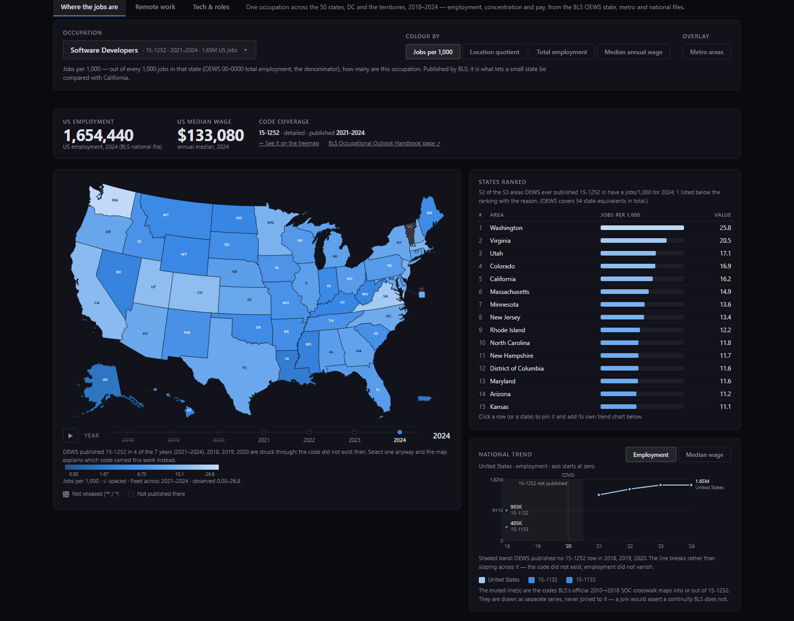
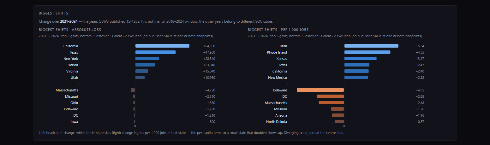
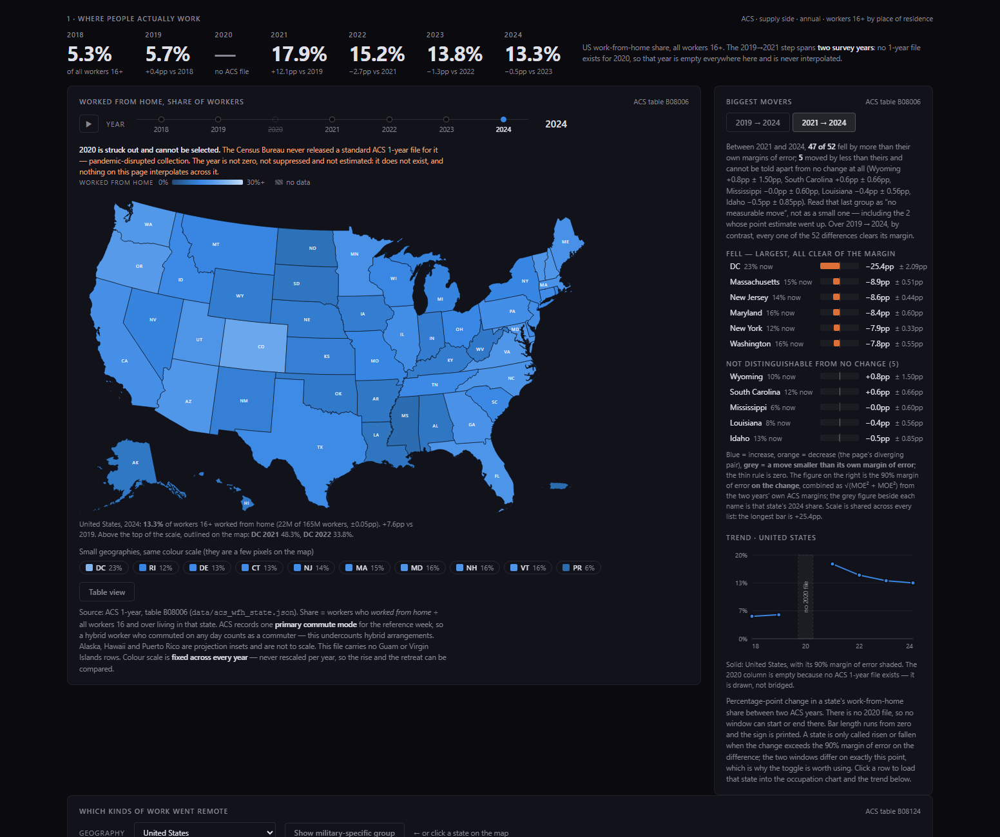
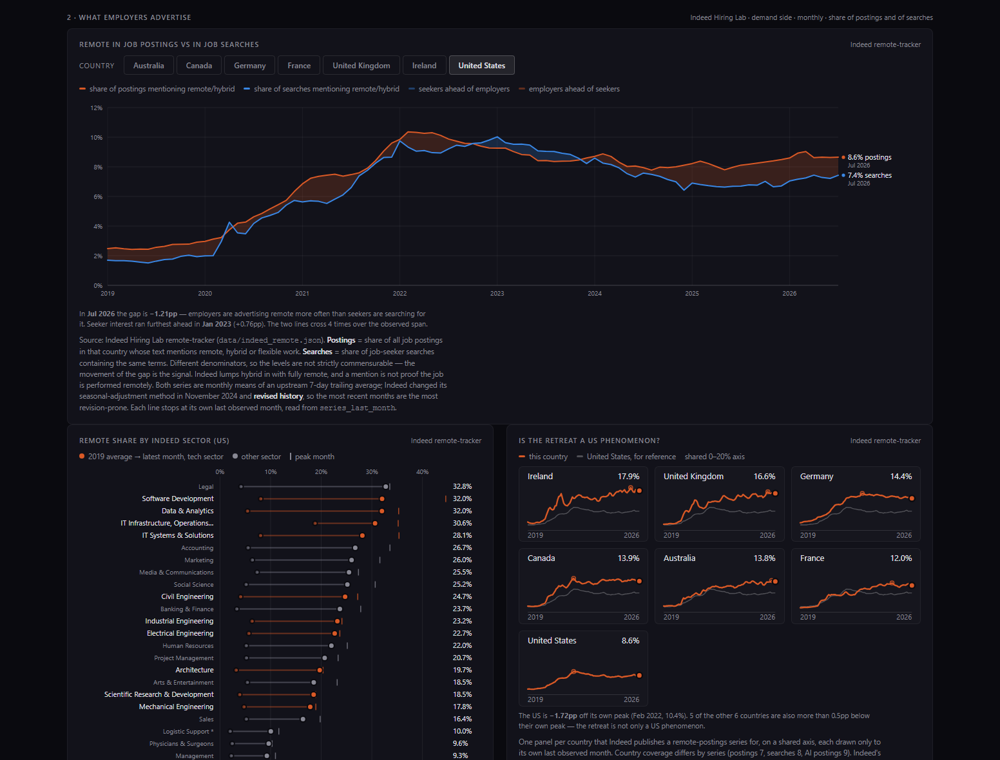
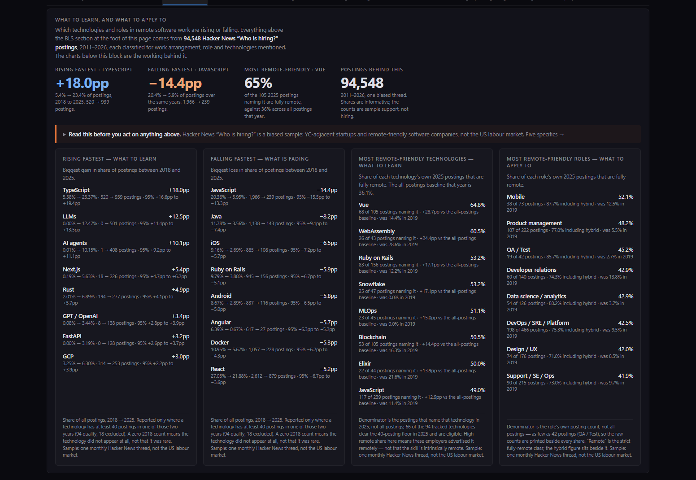
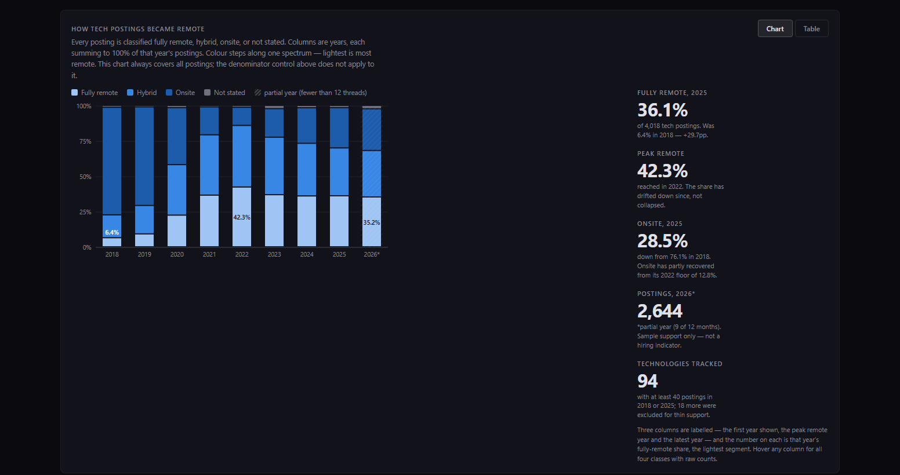
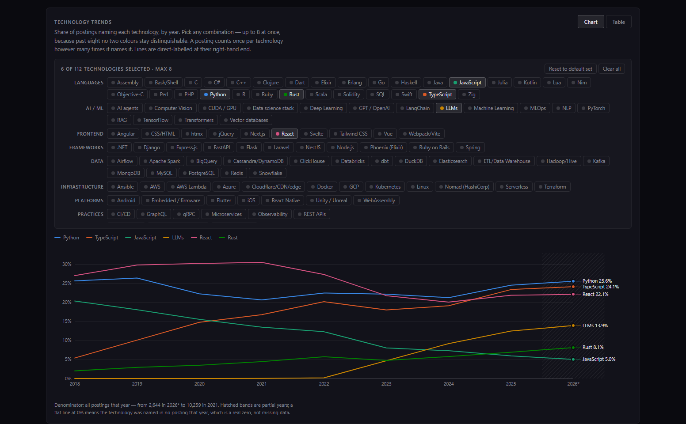
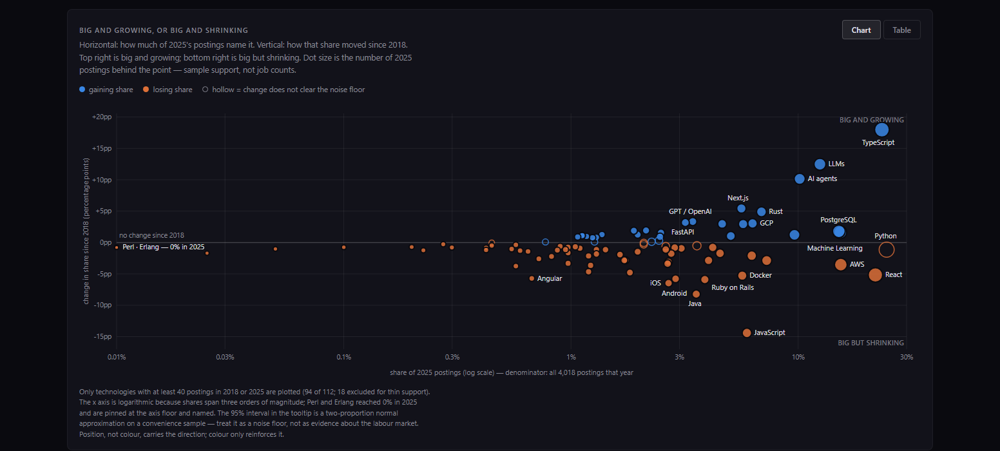
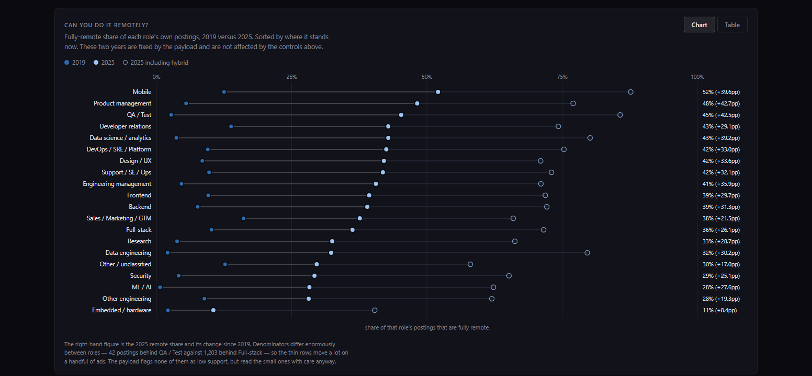
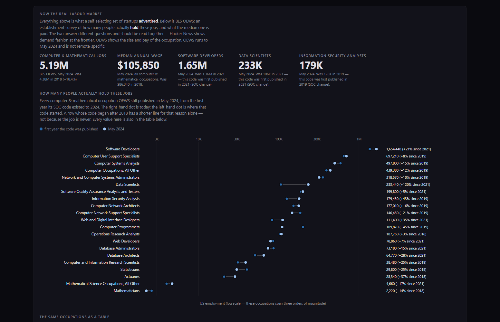

# US Job Market Visualizer + US Remote Job Explorer

A research tool for visually exploring US labour-market data. This is not a report, a paper, or a serious economic publication — it is a development tool for exploring public data visually.

This repository is a fork of [karpathy/jobs](https://github.com/karpathy/jobs), which visualises the Bureau of Labor Statistics [Occupational Outlook Handbook](https://www.bls.gov/ooh/) as a treemap of 342 occupations.

**This fork adds a second page — the US Remote Job Explorer** — which answers three questions a single-snapshot treemap cannot:

1. **Where** are occupations across the US, and how has that shifted over seven years?
2. **How far did remote work spread**, by state and by kind of work — and did it stay?
3. **For remote software work: which technologies and roles are rising or falling** — what is worth learning, and what is worth applying to?

It is built on six datasets the upstream project does not use, spans **2018–2026**, and ships as a static, zero-dependency page: no d3, no npm, no CDN, no build step. The US map is projected to SVG paths in Python, so the browser needs no mapping library.

---

# The US Remote Job Explorer

Open `site/explore.html`. Three tabs, one shared dataset layer, permalinks on every tab.

## 1 · Where the jobs are



Pick any of **967 occupations** and see it across all 50 states, DC and the territories, for every year **2018–2024**, from the BLS Occupational Employment and Wage Statistics (OEWS) files.

- **Colour by** jobs per 1,000 (concentration, so a small state is comparable with California), location quotient, total employment, or median annual wage.
- **Year slider with playback** animates the seven-year shift.
- **219 metro areas** as an optional bubble overlay, plus a ranked metro table — because for tech work the metro story is the real one.
- **States ranked** beside the map; click a row to pin a state and add its own trend line.

The screenshot shows the detail that matters most. Software Developers is SOC **15-1252**, and BLS only published that code from 2021. The trend chart does not draw a line back to 2018 — it draws the **predecessor codes 15-1132 and 15-1133 as separate, unjoined series**, because BLS's own 2010→2018 crosswalk says they are not continuous with it. The year slider strikes through 2018–2020 for exactly this reason, and still lets you select them, so the map can explain which code carried that work instead.



## 2 · Remote work



Two independent measurements, deliberately never combined into one line:

**Where people actually work** — Census ACS 1-year, table B08006, **2018–2024**. US work-from-home share went **5.3% (2018) → 5.7% (2019) → 17.9% (2021) → 13.3% (2024)**. The colour scale is fixed across every year, never rescaled per frame, so the rise *and* the partial retreat are both visible.

There is **no 2020**. The Census Bureau never released a standard ACS 1-year file for that year. The slider strikes it out, the trend chart leaves a labelled gap, and nothing on the page interpolates across it.

The "biggest movers" panel does not just rank point estimates. It combines each year's margin of error (`√(MOE₁² + MOE₂²)`) and reports **"47 of 52 fell by more than their own margins of error"** — the other five, including the two whose point estimate rose, are drawn in neutral grey and labelled *not distinguishable from no change*. Colouring them by sign would assert a direction the survey cannot support.

A second chart (ACS table B08124) breaks work-from-home down **by occupation group**, which is where the real story lives: management/business/science/arts went far more remote than service or production work ever did.



**What employers advertise** — Indeed Hiring Lab, **2019-01 to 2026-07**, daily, 10 countries, 53 occupational sectors. The most interesting chart on the page is the gap between the remote share of job *postings* and the remote share of job *searches*: what workers want versus what employers offer, drawn as an explicit band rather than two unrelated lines.

## 3 · Tech & roles — what to learn, what to apply to



The tab opens with the answer, not the working. Built from **94,548 job postings** scraped from **186 monthly "Ask HN: Who is hiring?" threads, 2011-04 to 2026-09**, each one parsed for work arrangement, role, seniority, salary and technologies mentioned.

**Biggest risers, share of postings 2018 → 2025:**

| Technology | Change | Detail |
|---|---|---|
| TypeScript | **+18.0pp** | 5.4% → 23.4% · 520 → 939 postings |
| LLMs | **+12.5pp** | 0% → 12.5% · 0 → 501 postings |
| AI agents | **+10.1pp** | 0.01% → 10.2% · 1 → 408 postings |
| Next.js | +5.4pp | 0.2% → 5.6% |
| Rust | +4.9pp | 2.0% → 6.9% |

**Biggest fallers:** JavaScript **−14.4pp** (20.4% → 5.9%, largely absorbed by TypeScript), Java −8.2pp, iOS −6.5pp, Ruby on Rails −5.9pp, Android −5.8pp, Angular −5.7pp, Docker −5.3pp, React −5.2pp.

Every figure carries its **raw posting counts on both endpoints** and a **95% two-proportion confidence interval**, and only technologies clearing a documented floor of 40 postings in an endpoint year are eligible (94 of 112 qualify; 18 are excluded as too thin). A technology that went from 2 to 6 postings cannot masquerade as a trend.



**The remote shift itself**, from the same corpus: fully remote went **6.4% (2018) → 42.3% (2022) → 36.1% (2025)**, while onsite fell 76.1% → 12.8% and then partly recovered to 28.5%. Remote did not collapse back — it plateaued well above where it started.



A **technology trend explorer** over 112 tracked technologies grouped by category, all directly labelled, any set comparable against any other. A denominator toggle re-bases every share onto *fully-remote postings only*, so you can ask "what do remote employers want" separately from "what does everyone want".



The **rising/falling quadrant** is the single most decision-useful chart: current share on x, change since 2018 on y. Top-right is big and growing — learn this. Bottom-right is big and shrinking.



**Roles** get the same treatment, because "is this role growing" and "can I do it remotely" are different questions. Most remote-friendly by share of each role's *own* postings that are fully remote: Mobile 52.1%, Product management 48.2%, QA/Test 45.2%, Developer relations 42.9%, Data science 42.9%, DevOps/SRE 42.5% — against a 36.1% all-postings baseline.



Finally, the HN signal is **grounded against the real labour market**. Hacker News tells you what a few thousand startups advertise; BLS OEWS tells you how many people actually hold the job. Data Scientists went **106K (2021) → 233K (2024)**; Information Security Analysts 126K → 179K. Both are on the page, labelled as the different things they are.

---

## Data sources

| Source | What it gives | Coverage |
|---|---|---|
| **BLS OEWS** state, metro, national | Employment, jobs/1,000, location quotient, wages by occupation | 2018–2024 · 54 areas · 219 MSAs · 967 occupations |
| **Census ACS** 1-year, B08006 / B08124 | Worked-from-home share by state and by occupation group, with margins of error | 2018–2024 (**no 2020**) |
| **Indeed Hiring Lab** remote + AI trackers | Remote share of postings and of searches; AI-mention share; postings index by sector and state | 2019-01 → 2026-07 · daily · 10 countries · 53 sectors |
| **Hacker News** "Ask HN: Who is hiring?" | 94,548 postings tagged with remote class, role, seniority, salary, technologies | 2011-04 → 2026-09 · 186 threads |
| **BLS SOC** structure + 2010→2018 crosswalk | Occupation hierarchy and the official code lineage | SOC 2018 · 1,447 codes |
| **BLS OOH** (upstream) | Pay, education, outlook, AI-exposure scores | 342 occupations |

Recovering ACS 2018 and 2019 needed the legacy sequence-based summary files — Census's modern table-based files only reach back to 2021 — which is what makes a genuine pre-COVID baseline possible.

## What this tool refuses to do

Most of the engineering went here, because the failure mode of a chart is looking confident while being wrong.

- **Suppression, top-coding and never-published are three different states, not three kinds of null.** BLS `**` means "estimate not released"; `*` means "wage unavailable"; `#` means the wage is **at or above** the top code (**$208,000/yr for 2018–2021, $239,200/yr from 2022**) — a censored *high* value, not missing data. Treating `#` as missing would bias every high-wage occupation downward. Across the state series that is 8,938 rows marked `**`, 22,067 marked `*` and 3,123 marked `#`; all of them round-trip exactly, and each marker is carried per field rather than flattened onto the row.
- **No occupation is compared across a SOC vintage break** unless BLS's own crosswalk says it is comparable. 83 codes exist in only one year; those render an explanation and a jump link to the successor code, never a bar chart of "+0".
- **No interpolation across the 2020 ACS hole.** It is drawn as a hole.
- **Survey noise is respected.** State-level ACS changes are tested against their own margins of error before being called a rise or a fall.
- **2026 is a partial year** (9 of 12 months) and is marked as such everywhere it appears, so it is never silently compared against a full year. The "latest full year" is 2025.
- **The Hacker News corpus is a biased sample** — YC-adjacent startups and remote-friendly software companies, not the US labour market. Posting volume fell from 10,259 (2021) to 2,644 (2026, partial), so *shares* are informative and *counts* are sample support, never a hiring indicator. That warning sits on each answer card, at the point of decision, not only in the page intro.
- **Nothing is smoothed or back-cast** to make a line look tidier.

Every number on screen traces to a file in `data/`, produced by a script in `pipeline/`.

## Performance

51 payloads under `site/explore/data/`. Initial load is **0.60 MB** against a 1.5 MB budget the build script enforces by exiting non-zero. The remaining 13.4 MB is lazy — the 10.9 MB state file is split into 23 bundles keyed by SOC major group, so choosing an occupation fetches roughly 270 KB.

---

# The original treemap (upstream)

The BLS OOH covers **342 occupations** spanning every sector of the US economy, with detailed data on job duties, work environment, education requirements, pay, and employment projections. The upstream project scraped all of it and built an interactive treemap where each rectangle's **area** is proportional to total employment and **color** shows the selected metric — toggle between BLS projected growth outlook, median pay, education requirements, and AI exposure.

**Upstream live demo: [karpathy.ai/jobs](https://karpathy.ai/jobs/)**

## LLM-powered coloring

The repo includes scrapers, parsers, and a pipeline for writing custom LLM prompts to score and color occupations by any criteria. You write a prompt, the LLM scores each occupation, and the treemap colors accordingly. The "Digital AI Exposure" layer is one example — it estimates how much current AI (which is primarily digital) will reshape each occupation. But you could write a different prompt for any question — e.g. exposure to humanoid robotics, offshoring risk, climate impact — and re-run the pipeline to get a different coloring. See `score.py` for the prompt and scoring pipeline.

**What "AI Exposure" is NOT:**
- It does **not** predict that a job will disappear. Software developers score 9/10 because AI is transforming their work — but demand for software could easily *grow* as each developer becomes more productive.
- It does **not** account for demand elasticity, latent demand, regulatory barriers, or social preferences for human workers.
- The scores are rough LLM estimates (Gemini Flash via OpenRouter), not rigorous predictions. Many high-exposure jobs will be reshaped, not replaced.

---

## Data pipeline

### Upstream — the OOH treemap

1. **Scrape** (`scrape.py`) — Playwright (non-headless, BLS blocks bots) downloads raw HTML for all 342 occupation pages into `html/`.
2. **Parse** (`parse_detail.py`, `process.py`) — BeautifulSoup converts raw HTML into clean Markdown files in `pages/`.
3. **Tabulate** (`make_csv.py`) — Extracts structured fields (pay, education, job count, growth outlook, SOC code) into `occupations.csv`.
4. **Score** (`score.py`) — Sends each occupation's Markdown description to an LLM with a scoring rubric. Each occupation gets an AI Exposure score from 0-10 with a rationale. Results saved to `scores.json`. Fork this to write your own prompts.
5. **Build site data** (`build_site_data.py`) — Merges CSV stats and AI exposure scores into a compact `site/data.json` for the frontend.
6. **Website** (`site/index.html`) — Interactive treemap with four color layers.

### This fork — the Remote Job Explorer

Every script is idempotent: upstream files are cached under `raw/` and never re-downloaded, and each run overwrites its `data/` output in place.

| Script | Produces |
|---|---|
| `pipeline/fetch_oews_state.py` | State + national OEWS, handling the SOC 2010→2018 break and BLS's combined 2019–2020 codes |
| `pipeline/fetch_oews_metro.py` | Metro OEWS, reduced to 219 MSAs under an explicit documented rule that retains tech hubs and CBSA codes retired in the 2023 re-delineation |
| `pipeline/fetch_acs_wfh.py` | ACS work-from-home by state and occupation group, including the 2018/2019 legacy backfill |
| `pipeline/fetch_indeed.py` | Indeed Hiring Lab remote, search and AI trackers |
| `pipeline/fetch_hn.py` → `parse_hn.py` | Caches every HN hiring thread, then parses postings with a re-runnable audit for ambiguous tokens (`Go`, `C`, `Lambda`) |
| `pipeline/build_geo.py` | Albers USA projection computed in Python — states ship as SVG path strings |
| `pipeline/build_crosswalk.py` | OOH ↔ SOC ↔ OEWS crosswalk using BLS's official 2010→2018 mapping |
| `pipeline/build_explore_data.py` | Slices `data/` into the 51 browser payloads |

Run the whole thing:

```bash
uv run python pipeline/fetch_oews_state.py
uv run python pipeline/fetch_oews_metro.py     # ~280 MB of downloads, cached
uv run python pipeline/fetch_acs_wfh.py
uv run python pipeline/fetch_indeed.py
uv run python pipeline/fetch_hn.py
uv run python pipeline/parse_hn.py
uv run python pipeline/build_geo.py
uv run python pipeline/build_crosswalk.py
uv run python pipeline/build_explore_data.py
```

## Key files

| File | Description |
|------|-------------|
| `site/explore.html` + `site/explore/` | **The Remote Job Explorer** — shell, shared runtime, one stylesheet, three views |
| `site/index.html` | Upstream treemap (links to the explorer, and back to a specific tile) |
| `data/` | Normalized datasets, the analysis source of truth |
| `data/SCHEMA.md` | Full schema, coverage and caveats for every dataset — read this first |
| `pipeline/` | Fetch, parse and build scripts |
| `occupations.json` | Master list of 342 occupations with title, URL, category, slug |
| `occupations.csv` | Summary stats: pay, education, job count, growth projections |
| `scores.json` | AI exposure scores (0-10) with rationales for all 342 occupations |
| `prompt.md` | All OOH data in a single file, designed to be pasted into an LLM |
| `html/` | Raw HTML pages from BLS (source of truth, ~40MB) |
| `raw/` | Cached upstream downloads (gitignored, ~576MB, reproducible) |

`data/hn_postings.jsonl` is the bulky one at 37 MB — all 94,548 individual postings, kept so the corpus can be re-analysed under a different taxonomy without re-scraping. The site itself only loads the aggregates.

## LLM prompt

[`prompt.md`](prompt.md) packages all the OOH data — aggregate statistics, tier breakdowns, exposure by pay/education, BLS growth projections, and all 342 occupations with their scores and rationales — into a single file (~45K tokens) designed to be pasted into an LLM. This lets you have a data-grounded conversation about AI's impact on the job market without needing to run any code. Regenerate it with `uv run python make_prompt.py`.

## Setup

```
uv sync
uv run playwright install chromium
```

An OpenRouter API key in `.env` is needed only for `score.py` (the upstream AI-exposure layer). The Remote Job Explorer pipeline needs no keys — every source it uses is public and unauthenticated.

```
OPENROUTER_API_KEY=your_key_here
```

## Usage

```bash
# Serve the site locally
cd site && python -m http.server 8000
# treemap:  http://localhost:8000/index.html
# explorer: http://localhost:8000/explore.html
```

## Credits

Built on [karpathy/jobs](https://github.com/karpathy/jobs). Data from the [BLS Occupational Employment and Wage Statistics](https://www.bls.gov/oes/), the [BLS Occupational Outlook Handbook](https://www.bls.gov/ooh/), the [Census American Community Survey](https://www.census.gov/programs-surveys/acs/), [Indeed Hiring Lab](https://github.com/hiring-lab), and [Hacker News](https://news.ycombinator.com/) via the [Algolia API](https://hn.algolia.com/api). All public, all unauthenticated.
